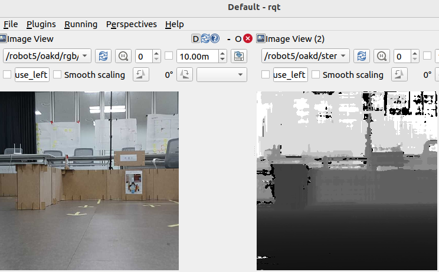
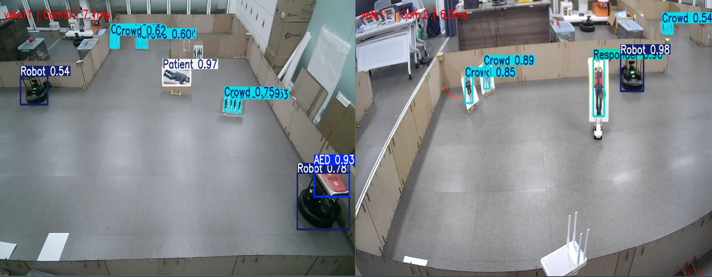
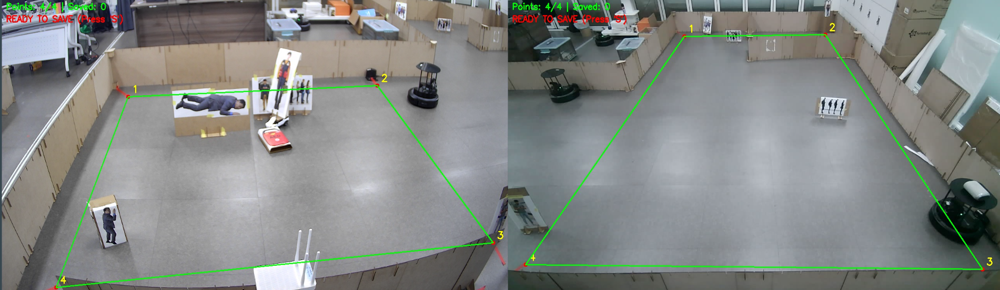

# 🚑 Subway Emergency Response AMR (지하철 응급 대응 자율주행 로봇)


## 1. 프로젝트 개요 (Project Overview)

### 개발 목표
지하철 역사 내 심정지 환자 발생 시 골든타임을 확보하기 위한 **응급 대응 자동화 시스템**.
CCTV(Webcam/OAK-D)가 환자를 인식하여 좌표를 추출하고, AMR(TurtleBot4)이 해당 위치로 신속하게 제세동기(AED)를 운반함.

### 핵심 기능
* **Vision AI**: YOLOv11 기반 실시간 객체 인식 (환자, 군중, 구급대원, AED, 로봇).
* **Coordinate Transformation**: CCTV 이미지 좌표(Pixel) → 2D 지도 좌표(Map Frame) 변환 (Homography).
* **Multi-Robot Control**: Flask 기반 관제 서버 및 다중 로봇 시나리오 제어.
* **Autonomous Navigation**: ROS 2 Nav2 스택을 활용한 동적 회피 및 자율주행.

---

## 2. 하드웨어 및 센서 구성 (Hardware & Sensor Setup)

### 🖥️ Computing & Robot
* **PC**: Ubuntu 22.04 LTS (ROS 2 Humble)
* **AMR**: TurtleBot 4 (Raspberry Pi 4 + iRobot Create 3)

### 📷 Vision Sensor: OAK-D Pro (Sensor Optimization)
단순한 카메라 사용을 넘어, 로봇 내부 파라미터 튜닝을 통해 **정확한 3D 공간 인식**과 **네트워크 효율성**을 확보함.



#### 🛠️ RGB-Depth Alignment & Bandwidth Tuning
터틀봇 내부(`SSH`)의 `oakd_pro.yaml` 설정 파일을 직접 수정하여 하드웨어 레벨에서 최적화를 수행함.

* **RGB-Depth 정렬 (Alignment)**:
    * **문제**: RGB 카메라와 Stereo Depth 센서의 물리적 위치 차이로 인해, 이미지 좌표(u, v)와 거리 정보(z) 간의 불일치 발생.
    * **해결**: `i_align_depth: true` 설정을 활성화하여 Depth Map을 RGB 카메라 시점에 맞춰 픽셀 단위로 정렬(Warping)함. 이를 통해 YOLO가 인식한 객체의 정확한 거리 및 3D 좌표 추출 성공.
* **네트워크 최적화 (Optimization)**:
    * **문제**: 고해상도 이미지 전송 시 무선 네트워크(Wi-Fi) 대역폭 포화로 인한 딜레이 발생.
    * **해결**: `i_low_bandwidth: true` 활성화 및 `i_fps: 10.0` 제한을 통해 화질 저하 없이 실시간 제어에 필요한 데이터 전송률 확보.

#### ⚙️ 적용된 OAK-D 설정 코드 (`oakd_pro.yaml`)
```yaml
/oakd:
  ros__parameters:
    camera:
      i_enable_imu: false
      i_enable_ir: false
      i_pipeline_type: RGBD
      i_usb_speed: SUPER_PLUS
    rgb:
      i_board_socket_id: 0
      i_fps: 10.0
      i_height: 704
      i_width: 704
      i_preview_size: 320
      i_enable_preview: true
      i_low_bandwidth: true        # 네트워크 대역폭 최적화
      i_keep_preview_aspect_ratio: true
      i_publish_topic: true
      i_resolution: '1080P'
    stereo:
      i_publish_topic: true
      i_align_depth: true          # [핵심] Depth Map을 RGB 시점으로 정렬
      i_fps: 10.0
```

---

## 3. 핵심 로직 (Core Logic)

### 🧠 1. YOLOv11 객체 인식

* **모델 선정**: `YOLOv11n` (Nano) 모델을 사용하여 엣지 디바이스에서의 추론 속도와 정확도(mAP) 밸런스 최적화.
* **학습 클래스**: `Responder`(구급대원), `Crowd`(군중), `Patient`(환자), `AED`, `Robot`.
* **역할 분담**:
* **웹캠(Global)**: 전체 상황 관제 및 환자 좌표 추출.
* **로봇 캠(Local)**: 근거리 정밀 인식 및 유도.



### 📐 2. Homography (Pixel to Map Transformation)

CCTV 화면상의 2D 좌표를 로봇이 이해할 수 있는 지도(Map) 좌표로 변환하는 핵심 알고리즘.

* **1단계: 리스너 및 ROI 설정**
* `imgEl.addEventListener`: 클릭 이벤트 감지.
* `getBoundingClientRect()`: 브라우저 화면상 이미지의 절대 위치 및 크기 계산.


* **2단계: 상대 좌표 계산 및 스케일링**
* 화면상 클릭 위치 `(clientX, clientY)`와 이미지 원본 해상도(`originalW/H`) 간의 비율(Scale Factor) 계산.
* 반응형 웹 환경에서도 좌표가 틀어지지 않도록 보정 로직 적용.


* **3단계: Perspective Transform**
* 사전에 캘리브레이션된 4개의 기준점(Reference Points)을 사용하여 Homography 행렬  산출.
*  연산을 통해 최종 목표 좌표 도출.
  


### 🏗️ 3. System Architecture & Workflow
응급 상황 발생부터 로봇 복귀까지의 전체 시나리오 흐름도입니다.

```mermaid
flowchart TD
    Start([시스템 대기 중<br/>충전 스테이션]) --> Monitor[관제 시스템 모니터링]
    Monitor --> Call{119 신고<br/>접수}
    Call -->|신고 있음| CCTV[CCTV 영상 확인<br/>YOLO 자동 분석]
    Call -->|신고 없음| Monitor
    
    CCTV --> YOLODetect{YOLO<br/>쓰러진 사람<br/>인식?}
    
    YOLODetect -->|인식 성공| AutoCoord[환자 좌표 자동 설정<br/>화면 표시]
    AutoCoord --> ReadyBtn[출동 준비 상태<br/>출동 버튼 활성화]
    
    YOLODetect -->|인식 실패<br/>사람 많음| ManualClick[관제사 직접 클릭<br/>CCTV 화면에서<br/>환자 위치 지정]
    ManualClick --> ManualCoord[환자 좌표 수동 설정<br/>화면 표시]
    ManualCoord --> ReadyBtn
    
    ReadyBtn --> DispatchBtn{관제사<br/>출동 버튼<br/>클릭}
    DispatchBtn -->|클릭| Dispatch[로봇 출동 시작<br/>5초 이내]
    DispatchBtn -->|대기| ReadyBtn
    
    Dispatch --> RobotA_Start[로봇 A: 환자 좌표로 출발<br/>AED 적재 확인]
    Dispatch --> RobotB_Start[로봇 B: 계단 입구로 출발]
    
    RobotA_Start --> RobotA_Nav[Navigation2<br/>자율 주행<br/>장애물 회피]
    RobotA_Nav --> RobotA_Arrive[환자 도착<br/>1분 30초 이내<br/>±30cm 오차]
    RobotA_Arrive --> RobotA_AED[AED 전달 자세<br/>180도 회전<br/>음성 안내 시작]
    
    %% === 수정된 AED 사용 확인 로직 ===
    RobotA_AED --> RobotA_Timer[2분 타이머 시작<br/>관제 화면 표시]
    RobotA_Timer --> RobotA_Check{AED 전달 확인?}
    RobotA_Check -->|관제사<br/>수동 확인 버튼| RobotA_Control[통제 모드 전환<br/>환자 주변 2m 반경<br/>안전 거리 확보]
    RobotA_Check -->|2분 자동 경과| RobotA_Control
    RobotA_Check -->|대기 중| RobotA_Timer
    
    RobotA_Control --> RobotA_Monitor[LiDAR로 접근자 감지<br/>비켜주세요 방송<br/>영상 관제실 전송]
    
    RobotB_Start --> RobotB_Nav[Navigation2<br/>자율 주행]
    RobotB_Nav --> RobotB_Arrive[계단 입구 도착<br/>경광등 ON]
    RobotB_Arrive --> RobotB_Wait[대기 모드<br/>구급대 감지 대기]
    
    RobotB_Wait --> RobotB_Trigger{구급대<br/>도착 감지?}
    RobotB_Trigger -->|관제실 START_GUIDE 명령| RobotB_Guide[구급대 유도 시작<br/>저를 따라오세요 방송]
    RobotB_Trigger -->|대기 중| RobotB_Wait
    
    RobotB_Guide --> RobotB_Lead[환자 좌표까지<br/>Navigation2 선행 주행<br/>최단 경로]
    RobotB_Lead --> RobotB_PatientArrive[환자 위치 도착<br/>유도 완료]
    
    RobotA_Monitor --> Complete{구급대<br/>환자 인계<br/>완료?}
    RobotB_PatientArrive --> Complete
    
    Complete -->|인계 완료| Log[이벤트 로그 기록<br/>발생 시각, 위치<br/>로봇 동작 이력<br/>처치 이력 DB 저장]
    Complete -->|대기| RobotA_Monitor
    
    Log --> Return[복귀 명령<br/>충전 스테이션으로]
    
    Return --> BatteryCheck{배터리<br/>20% 이상?}
    BatteryCheck -->|정상| Monitor
    BatteryCheck -->|20% 이하| Charging[충전 스테이션<br/>자율 도킹]
    Charging --> Monitor
    
    style Start fill:#e1f5ff
    style Call fill:#fff4e1
    style YOLODetect fill:#ffe1e1
    style DispatchBtn fill:#ffcccc
    style Complete fill:#e1ffe1
    style Monitor fill:#f0f0f0
    style RobotA_Control fill:#ffe1f0
    style RobotB_Lead fill:#f0e1ff
    style RobotA_Timer fill:#fff9e1
    style AutoCoord fill:#e1ffe1
    style ManualCoord fill:#ffffcc
```



---

## 4. 설치 및 환경 구성 (Installation)

### 4.1 의존성 설치 (Prerequisites)

```bash
# 1. 워크스페이스 생성
mkdir -p ~/turtlebot4_ws/src
cd ~/turtlebot4_ws/src

# 2. 필수 패키지 클론
git clone [https://github.com/turtlebot/turtlebot4.git](https://github.com/turtlebot/turtlebot4.git) -b humble
git clone [https://github.com/turtlebot/turtlebot4_simulator.git](https://github.com/turtlebot/turtlebot4_simulator.git) -b humble
git clone [https://github.com/turtlebot/turtlebot4_desktop.git](https://github.com/turtlebot/turtlebot4_desktop.git) -b humble

# 3. 의존성 설치 및 빌드
cd ~/turtlebot4_ws
rosdep update
rosdep install --from-path src -yi --rosdistro humble
colcon build --symlink-install
source install/setup.bash

```

### 4.2 네트워크 설정 (중요)

`~/.bashrc` 파일에 아래 내용을 추가하여 PC와 로봇 간 통신 채널을 맞춤.

```bash
export ROS_DOMAIN_ID=30  # 팀 ID 통일
export RMW_IMPLEMENTATION=rmw_cyclonedds_cpp
export ROS_LOCALHOST_ONLY=0

```

---

## 5. 실행 가이드 (Execution Guide)

**⚠️ 주의**: 모든 터미널 실행 전 `source install/setup.bash` 필수.

### STEP 0: 내비게이션 실행 (Robot Side)
각 로봇(Robot 5, Robot 3)마다 **Localization(위치 추정) → RViz(시각화) → Nav2(자율주행)** 순서로 3개의 노드를 모두 실행해야 정상 작동함.

#### 🤖 Robot 5 실행 명령어
```bash
# 1. Localization (지도 매칭)
ros2 launch turtlebot4_navigation localization.launch.py namespace:=/robot5 map:=/home/juyeong/Documents/maps/map_251224.yaml

# 2. RViz (시각화 도구)
ros2 launch turtlebot4_viz view_robot.launch.py namespace:=/robot5

# 3. Nav2 (자율주행 스택)
ros2 launch turtlebot4_navigation nav2.launch.py namespace:=/robot5
```

#### 🤖 Robot 3 실행 명령어
```Bash

# 1. Localization (지도 매칭)
ros2 launch turtlebot4_navigation localization.launch.py namespace:=/robot3 map:=/home/juyeong/Documents/maps/map_251224.yaml

# 2. RViz (시각화 도구)
ros2 launch turtlebot4_viz view_robot.launch.py namespace:=/robot3

# 3. Nav2 (자율주행 스택)
ros2 launch turtlebot4_navigation nav2.launch.py namespace:=/robot3
```

### STEP 1: 관제 서버 실행 (Server)

Flask 기반 웹 UI 구동 (포트 5000).

```bash
ros2 run subway_control server
# 접속: http://localhost:5000

```

### STEP 2: Vision 시스템 실행 (CCTV)

YOLO 추론 및 좌표 변환 노드. 이 노드가 실행되어야 `/target` 토픽이 발행됨.

```bash
python3 src/yolo/yolo/yoloNoUI.py

```

### STEP 3: 로봇 컨트롤러 실행 (Control)

환자 발생 시나리오 수행 및 자율주행 명령 하달.

```bash
python3 src/robotA_control/robotA_control/robotA_control_with_YOLO_3.py

```

---

## 6. 프로젝트 시연 (Demo & Screenshots)

### 🎬 1. 전체 시연 동영상 (Full Scenario)
> *환자 발생 감지부터 로봇 도착, AED 전달까지의 전체 과정*

[](https://youtu.be/2cp6uCiXWT4)

### 🖥️ 2. 관제 시스템 UI 시연 (Web Interface)
> *Flask 기반 관제 서버의 실시간 모니터링 및 제어 화면*

[](https://youtu.be/WdPW3HTq1eE)

---

## 7. 트러블슈팅 (Troubleshooting)

* **네트워크 연결 실패**: `ping <ROBOT_IP>` 확인 및 `ROS_DOMAIN_ID` 일치 여부 점검.
* **맵 로드 에러**: `nav2.launch.py` 실행 시 `map.yaml`의 절대 경로가 올바른지 확인.
* **좌표 오차 발생**: 웹캠의 위치가 변경되었을 경우, Homography 캘리브레이션 재수행 필요.

---

## ⚖️ License & Copyright

**Copyright (c) 2026 Juyeong & Team. All Rights Reserved.**

본 프로젝트의 소스 코드 및 관련 문서의 무단 복제, 배포, 상업적 이용을 금지합니다.
This software provides a proprietary solution for emergency response AMR systems.
Unauthorized copying of this file, via any medium is strictly prohibited.